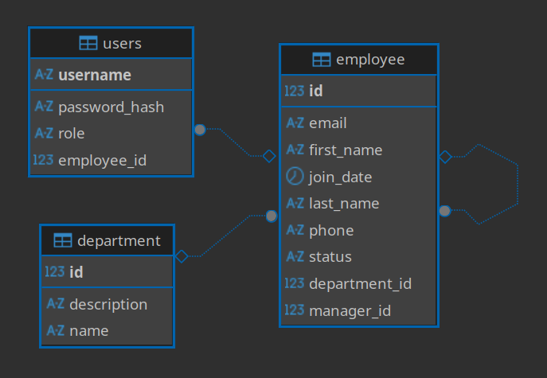

# Employee Management System 🏢

 

A full-stack, containerized Employee Management System built to demonstrate end-to-end software development, from system architecture and robust API design to automated CI/CD pipelines and self-hosted infrastructure. 

While the application itself serves as a straightforward CRUD platform for managing employee records, the primary engineering objective of this project was to establish a production-grade **Java/Spring Boot ecosystem**, implement robust testing strategies, and architect a completely automated deployment workflow.

---

## 🔗 Project Navigation & Live Links

This repository serves as the central hub for the system. The source code is maintained in the following child repositories under the **Shumisoft** organization:

* **Frontend Repository:** [shumisoft/employee-management-system-frontend](https://github.com/shumisoft/employee-management-system-frontend)
* **Backend Repository:** [shumisoft/employee-management-system-backend](https://github.com/shumisoft/employee-management-system-backend)

**Live Environments:**
* 🌐 **Frontend Application:** [here](https://ems-fe.shumisoft.com)
* ⚙️ **Backend API Base URL:** [here](https://ems-be.shumisoft.com)
<!--* 📖 **API Documentation (Swagger/Postman):** [Insert Link if applicable]-->

---

## 🏗️ System Architecture

<!--*([Insert a high-quality Architecture Diagram here. Tools like Draw.io or Excalidraw work great. Show the user connecting to Vercel, Vercel talking to your OCI VPS, and the internal Docker network on the VPS.])*-->

### Core Technologies
* **Frontend:** Angular (20), JWT Authentication
* **Backend:** Java (17+), Spring Boot (3.5), Spring Security
* **Database:** PostgreSQL
* **Infrastructure:** Oracle Cloud Infrastructure (OCI) Free Tier, Ubuntu 24.04 LTS
* **DevOps:** Docker, Docker Compose, Jenkins, Watchtower

---

## 🗄️ Database & Data Modeling

The system uses *PostgreSQL* to ensure data integrity and ACID compliance. The data model is mapped using JPA/Hibernate within the Spring Boot backend. 

Below is the Entity-Relationship (ER) diagram representing the core domain model:

---

## 🚀 Infrastructure & Deployment

The infrastructure is entirely self-managed on a high-performance, ARM-based cloud instance, emphasizing cost-efficiency, modern compute architectures, and automation.

* **Frontend Hosting:** Deployed seamlessly on **Vercel's** global edge network.
* **Backend VPS:** Hosted on a self-managed **Oracle Cloud Infrastructure (OCI) Ampere instance** (4-core ARM vCPUs, 24GB RAM, 200GB Block Storage) running **Ubuntu 24.04 LTS**.
* **Containerization & Multi-Arch Builds:** The backend and database are containerized. Because the VPS runs on an ARM architecture, the CI/CD pipeline utilizes **Docker Buildx** to compile and push multi-platform containers, ensuring compatibility across both ARM and AMD64 environments.
* **Zero-Downtime Updates:** A **Watchtower** container actively monitors the Docker registry. When a new multi-arch image is pushed via Jenkins, Watchtower pulls the latest image and gracefully redeploys the `docker-compose` stack without manual intervention.

---

## 🔄 CI/CD Pipeline & Testing Strategy

<!--*([Insert a CI/CD Flow Diagram here. Show the flow from GitHub Push -> Jenkins -> Tests -> Docker Build -> Docker Push -> Watchtower])*-->

A custom **Jenkins** pipeline (running directly on the ARM VPS) was built from scratch to ensure code reliability and automate delivery.

1.  **Checkout & Compile:** Jenkins pulls the latest code from VCS upon webhook invocation and compiles the Spring Boot application.
2.  **Unit & Integration Testing:** Executes unit tests via **JUnit/Mockito** and data-layer integration tests using **Testcontainers** (spinning up ephemeral databases matching production).
3.  **Cross-Platform Build & Package:** If tests pass, Jenkins uses `docker buildx` to build the multi-architecture container images.
4.  **Registry Push:** The images are pushed to a centralized Docker container registry, ready for Watchtower to pull.

---

## 👥 Team & SDLC Workflow

This project was built from the ground up by a collaborating team operating under the **Shumisoft** GitHub organization. 

Given the lean team size, we optimized our Software Development Life Cycle (SDLC) for rapid iteration, high-bandwidth communication, and strict task ownership over heavy bureaucratic processes:
* **Agile Task Management:** We utilized **Trello** to track sprints, manage the product backlog, and strictly define the scope of our MVP (Minimum Viable Product).
* **Rapid Iteration:** Operating as a tight-knit unit allowed us to bypass formal PR reviews in favor of synchronous pair-programming sessions and direct code integrations, drastically speeding up the development cycle.
* **Full-Stack Ownership:** Both engineers took cross-functional ownership of the stack, contributing to the Angular frontend, Spring Boot backend, and the underlying Jenkins/Docker deployment pipelines.
